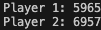

# Blackjack-Simulator
This project is a simulator that plays blackjack but with many different solvers and stratergies. 
I first started with building the base game logic first. There are mainly three moving parts in blackjack: The Dealer, The Player, and The Deck. These are the foundamental units of the game. 
So, I started with building these classes and objects first. To run it, just run main.py and it will play 100,000 hands and give the bankroll of each player after. 
## Dealer
The dealer class is a class that stores all the neccesary atributes for the dealer to run. Dealer needs to be storing his hand, get sum of hand, and have the ability to make decisions.
In this game, I decided that we would have soft 17, meaning that if dealer total equals 17, dealer stands. This makes the dealer a little stronger as he is likely to bust if he hits on 17.

## Player
The player class needs to emulate the play style of a player. To do that, we need to keep track of their bets, hand, and bankroll. Then based on our hand, we need to maek decisions. For that, we create a method that takes the deck, hand, and dealer up card and let the solver do the work for us. 

## Deck
The Deck class possess the ability to create the deck depending on how many shoes we have. It can get the probability of a certain card depending on context and what cards are left in the deck. This is hugely important because it can be used to make highly accurate decisions for the sovler. We have a deal function, which randomly deals a card based on using the random integer between 1 and deck size and finding card at that index location. 

## blackjack.py
This contains the main logic for the game. In play_round(), we deal the cards in the order of standard blackjack, with players and then dealer and repeat for the second card. The first card dealt to dealer is always the face up card. Then, we run through the decisions of each player. Whether they hit, stand, double, or split. Then, after each player has stood, we check the result by dealing out the dealer. Then, we settle the results by checking if the bust, 21, or blackjack. I have not included dealer hitting blackjack in this and all the bets are standard size, meaning each players starts with one as their bet and no more. Thes are things I plan on adding as I haven't yet. 

Now, we have the solvers. I two main solver with a third one as the superclass: bayesianSolver, and emanSolver
## Eman Solver
EmanSovler is named after my friend, and this represents the intuition of a normal player with a decent amount of experience in blackjack. I have made a chart with all the decisions based on dealer up card, soft hand(contains A), hard hands, or pairs. It returns the result with the decision that correlates with the chart. 

## BayesianSovler
BayesianSolver is the solver that uses probability of getting certain hands and multiplying that by the probabilty the dealer beats you to get the best ev. To break it down, it calculates the ev of the applicable moves. Either to hit, stand, double, or split. In essence, I am making a huge decision tree based on the dealer up card and player card. To calculate the ev for hit, I brute force all the possible combinations of one card that could be dealt to the player and running a decide on it. It multiplies the returned_ev by the probablity of the one card assumed. For stand, I need to see what are the possible dealer totals and their probabilities. To that end, I use recursion to simulate the dealer decision tree and then checking if dealer beats player. If dealer beats player, I subtract the probablity of dealer having that hand. If dealer busts or player beats dealer, I add the probability of this to the ev. Once I get the total, I return that. To gather double ev, I just run thirteen stand decisions for each card and times the probability of getting that card. For split, right now, I have a chart that returns a decision based on dealer up card and the exact pair. One of the big challenges of this solver is the sheer amount of time it takes to run. Because all these brute force every single combination of hands possible, it takes a huge amount of time and I don't have a super computer. To optimize this so I could actually run 100,000 hands, I had to remove bottlenecks and approximate certain calculations. For the dealer probabilities, I simplified it so it would use only a 1 shoe deck. For the entire hand, I would keep track and cache the result of a simulation in order to simplify the deep trees. Lastly, I would clear the cache in order to free as much space as possible. These improved the effeciency of the algorithm by a lot, but whenever I got pairs, it was extremely long. To simplify this completely, I just used the table from EmanSolver. 

## Results
Here are the results from one run playing 100,000 hands.  

Player 1 is eman solver and Player 2 is the bayesian solver. Clearly, both of these are losing to the dealer in the long run, player 1 averaging about -0.04 bets per round and player 2 about -0.03 bets per round. To improve these, I want to add a way to count cards and change bet sizing based on the situation of the game, more 10s(10,j,q,k,A) means larger bet. 
